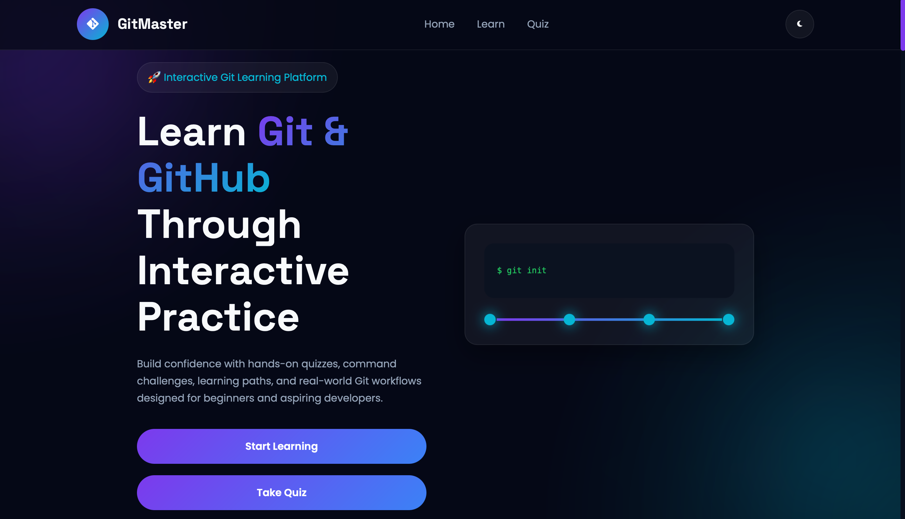
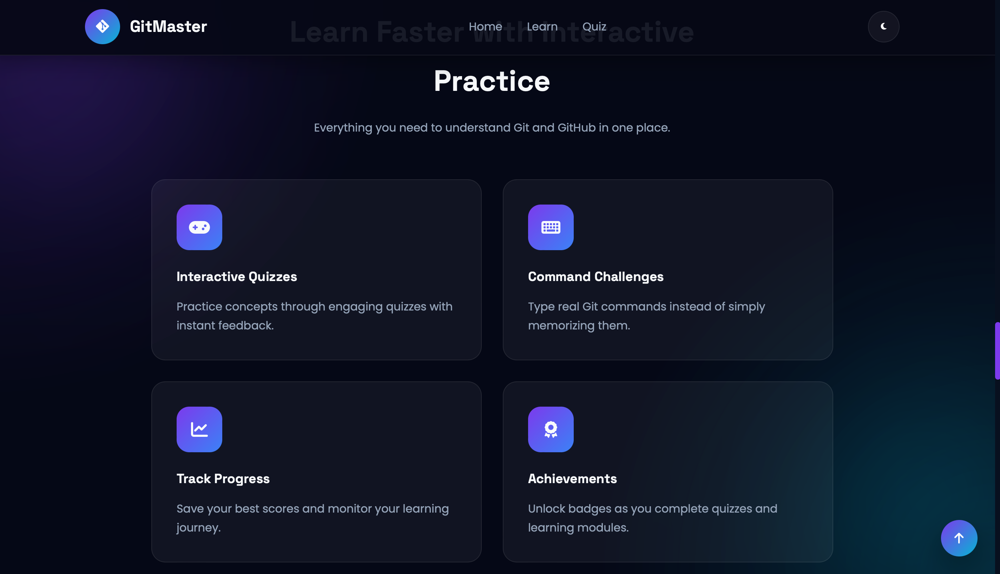
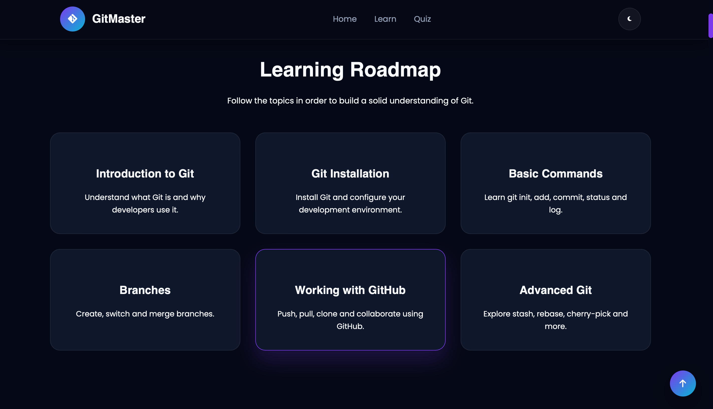
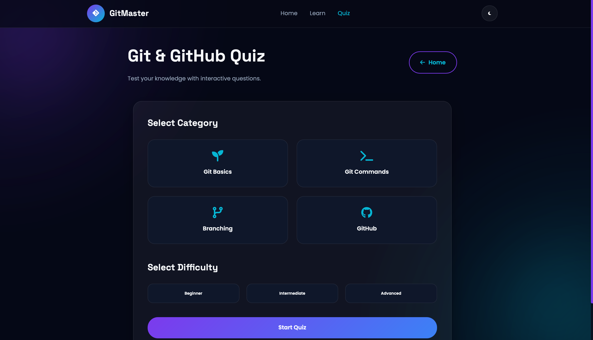
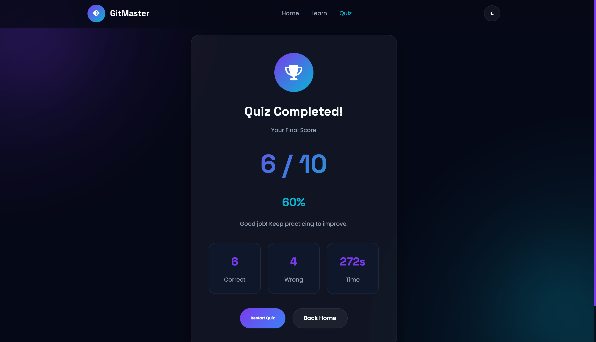
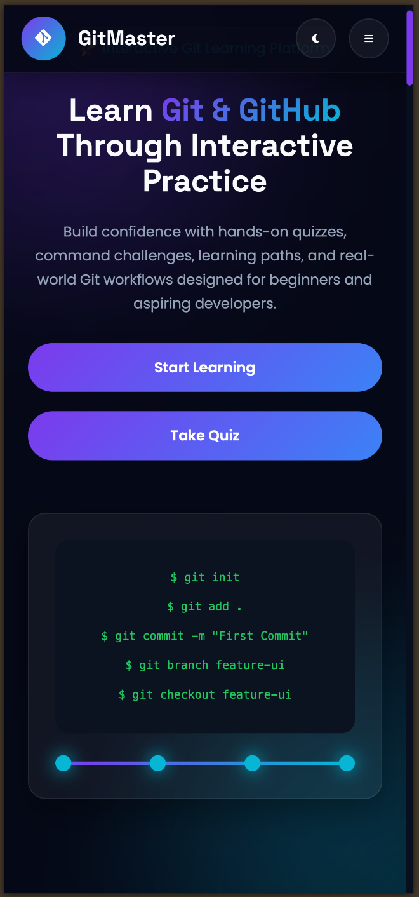
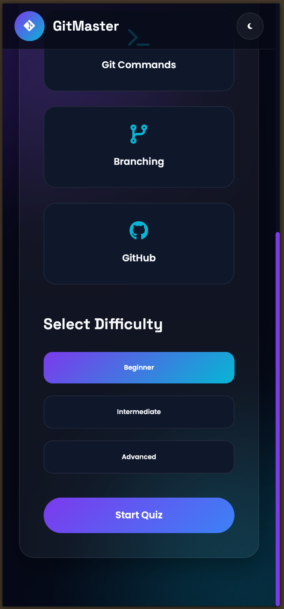

# 🚀 GitMaster

<p align="center">
  <strong>An interactive Git learning platform designed to help beginners master Git through structured lessons, visual roadmaps, and engaging quizzes.</strong>
</p>

<p align="center">
  
  
  
  
</p>

---

## 🌐 Live Demo

🔗 https://git-master-lake.vercel.app

---

## 📖 Overview

GitMaster is a modern web application that provides an interactive way to learn Git fundamentals. Instead of reading lengthy documentation, users can follow structured lessons, explore a beginner-friendly roadmap, and reinforce concepts through quizzes.

Whether you're new to Git or looking to revise essential concepts, GitMaster offers an engaging learning experience with a clean, responsive interface.

---

## ✨ Features

- 📚 Interactive Git learning modules
- 🛣️ Beginner-friendly Git roadmap
- 🧠 Multiple quiz categories
- 🎯 Difficulty levels (Easy, Medium, Hard)
- ⏱️ Quiz timer and score tracking
- 📊 Progress tracking
- 💾 LocalStorage support
- 🌙 Dark & Light mode
- 📱 Fully responsive design
- ✨ Smooth animations
- ⚡ Fast and lightweight
- 🎨 Modern UI/UX

---

## 🛠️ Tech Stack

| Technology | Purpose |
|------------|---------|
| HTML5 | Structure |
| CSS3 | Styling |
| JavaScript (ES6) | Functionality |
| Font Awesome | Icons |
| Google Fonts | Typography |

---

## 📂 Project Structure

## 📂 Project Structure

```text
GitMaster
├── assets/
├── css
│   ├── style.css
│   ├── learn.css
│   └── quiz.css
├── js
│   ├── script.js
│   ├── questions.js
│   └── quiz.js
├── index.html
├── learn.html
├── quiz.html
├── .gitignore
├── LICENSE
└── README.md
```

---

## 📸 Screenshots

### 🏠 Home Page



---

### 🏠 Home Page (Alternative)



---

### 📚 Learn Page



---

### 🧠 Quiz Page



---

### 🏆 Quiz Results



---

### 📱 Mobile Home Page



---

### 📱 Mobile Learn Page


---

### 📱 Mobile Quiz Page



---

## 🚀 Getting Started

### Clone the repository

```bash
git clone https://github.com/ByteBender9/GitMaster.git
```

### Navigate to the project

```bash
cd GitMaster
```

### Run the project

Simply open **index.html** in your preferred web browser.

No installation or additional dependencies are required.

---

## 🎯 Learning Modules

- Git Introduction
- Repository Basics
- Git Commands
- Branching
- Merging
- GitHub Workflow

---

## 📝 Quiz Categories

- Git Basics
- Git Commands
- Branching
- GitHub

Each category contains multiple questions with different difficulty levels.

---

## 🔮 Future Improvements

- More Git lessons
- Interactive Git playground
- Git command simulator
- Achievement badges
- User authentication
- Progress synchronization
- Leaderboards
- Backend integration

---

## 🤝 Contributing

Contributions, suggestions, and feature requests are welcome.

1. Fork the repository
2. Create a feature branch

```bash
git checkout -b feature-name
```

3. Commit your changes

```bash
git commit -m "Add new feature"
```

4. Push your branch

```bash
git push origin feature-name
```

5. Open a Pull Request

---

## 📄 License

This project is licensed under the MIT License.

See the **LICENSE** file for more details.

---

## 👨‍💻 Author

**Kushal Sarkar**

- Email: connect.kushals@gmail.com
- GitHub: https://github.com/ByteBender9
- LinkedIn: https://www.linkedin.com/in/kushalsarkar

---

⭐ If you found this project helpful, consider giving it a star!